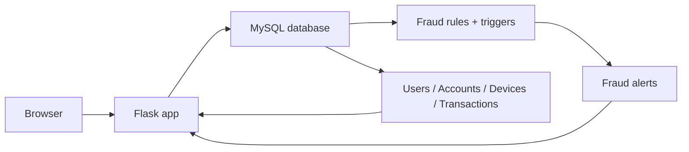
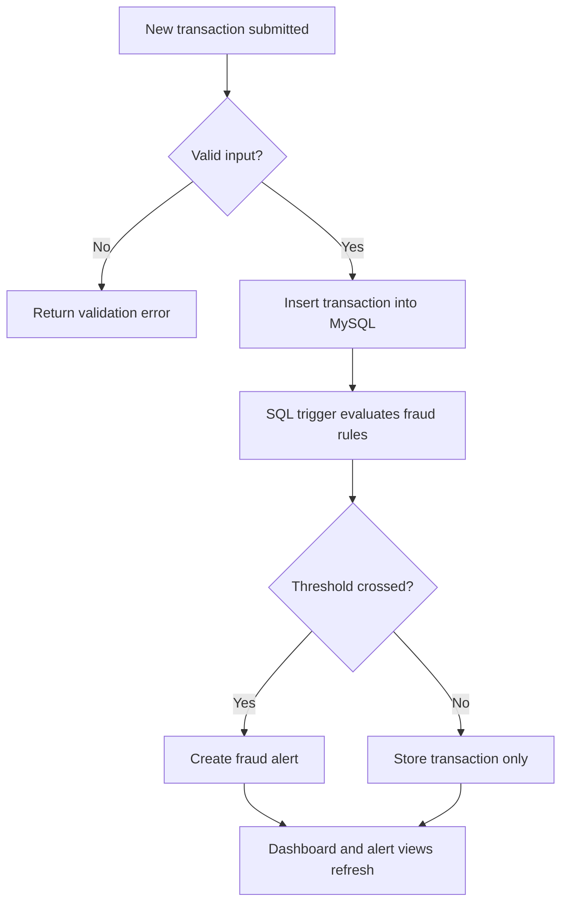

# Fraud Detection Engine

SQL-first fraud monitoring dashboard built with Flask and MySQL. The application surfaces users, accounts, devices, transactions, alerts, and risk scores while keeping the detection logic inside the database layer for explainability and consistency.

## Overview

This project demonstrates an end-to-end fraud monitoring workflow:

- transactional data is stored in MySQL
- SQL triggers generate fraud alerts
- Flask renders operational views and lightweight JSON APIs
- the UI highlights suspicious activity and high-risk users

It is designed for public release, so the repository documentation avoids secrets, private endpoints, and environment-specific values.

## Key capabilities

- Transaction review with an add-transaction modal
- Automated fraud detection through SQL triggers
- Alert filtering by severity and status
- Alert resolution/reopen actions from the UI
- Risk-ranked user table with top-risk highlighting
- Live dashboard cards and periodic refresh for key metrics
- JSON endpoints for integration or automation

## Architecture





## Repository layout

| Path | Purpose |
| --- | --- |
| `scripts/app.py` | Flask application, routes, queries, and API responses |
| `scripts/templates/` | Jinja templates for dashboard, alerts, transactions, and users |
| `scripts/static/style.css` | UI styling and responsive layout |
| `database/database.sql` | Recommended schema, constraints, indexes, sample data, and triggers |
| `database/dbms.sql` | Extended SQL lab script and exploratory examples |
| `scripts/generate_database_sql.py` | Deterministic generator for rebuilding the sample database script |
| `requirements.txt` | Python dependencies |

## Tech stack

- Python 3
- Flask
- PyMySQL
- MySQL / MariaDB-compatible SQL
- HTML, CSS, and a small amount of client-side JavaScript

## Prerequisites

- Python 3.10+
- MySQL 8+ or a compatible MariaDB build
- A browser for the dashboard UI

## Quick start

### 1) Create a virtual environment

```bash
python -m venv .venv
.venv\Scripts\activate
pip install -r requirements.txt
```

### 2) Configure environment variables

Set these before starting the app:

| Variable | Purpose |
| --- | --- |
| `DB_HOST` | Database host |
| `DB_PORT` | Database port |
| `DB_NAME` | Database name |
| `DB_USER` | Database user |
| `DB_PASSWORD` | Database password |
| `SECRET_KEY` | Flask session secret |
| `HOST` | Web host bind address |
| `PORT` | Web port |

Example:

```bash
DB_HOST=localhost
DB_PORT=3306
DB_NAME=fraud_engine
DB_USER=<your-user>
DB_PASSWORD=<your-password>
SECRET_KEY=<strong-random-value>
```

### 3) Initialize the database

Load `database/database.sql` into MySQL. It creates the schema, indexes, fraud rules, sample data, and triggers needed by the app.

If you want to regenerate the SQL file used in the repo, run the generator script:

```bash
python scripts\generate_database_sql.py
```

### 4) Start the app

```bash
python scripts\app.py
```

Then open the local URL printed by Flask, typically `http://127.0.0.1:5000`.

## Core routes

| Route | Method | Purpose |
| --- | --- | --- |
| `/` | GET | Main dashboard with summary cards and recent activity |
| `/transactions` | GET | Transaction feed with filters |
| `/add_transaction` | POST | Insert a new transaction |
| `/alerts` | GET | Alert stream with severity/status filters |
| `/alerts/<id>/toggle-status` | POST | Resolve or reopen an alert |
| `/users` | GET | User risk ranking and summary table |
| `/api/summary` | GET | Summary metrics in JSON |
| `/api/recent-alerts` | GET | Recent suspicious transactions in JSON |
| `/api/alerts` | GET | Filtered alerts in JSON |
| `/api/rules` | GET | Most triggered fraud rules in JSON |

## Data model

The application centers on five tables:

1. `users` — customer identities and risk scores
2. `accounts` — accounts tied to users
3. `devices` — device inventory and first-seen timestamps
4. `transactions` — transaction records monitored for fraud
5. `fraud_rules` / `fraud_alerts` — rule definitions and generated alerts

The schema uses foreign keys, indexes, and constraints to keep the dataset consistent and the alert pipeline predictable.

## Public release notes

- The repository is intended for public visibility, so do not commit real credentials or private database endpoints.
- Keep demo data synthetic and review any seeded records before publishing externally.
- If you plan to deploy this beyond a demo, replace the sample secret key and audit the database script for your environment.

## Development notes

- Fraud detection logic intentionally lives in SQL so the behavior is easy to inspect and explain.
- The dashboard and alert pages auto-refresh key data to keep the UI current.
- `database/database.sql` is the recommended source of truth for setup; the larger `dbms.sql` file contains extra exploratory SQL content.

## License

This project is under development and has been pre-released purely for educational purposes. Distribution or copying the work in any form is strictly prohibited.

## Authors

Yatharth Garg & Darsh M Saraf
